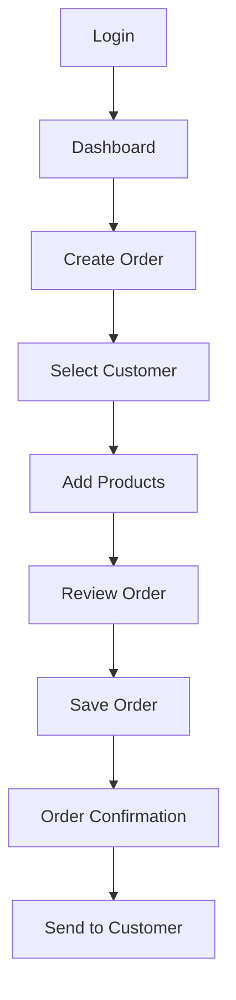
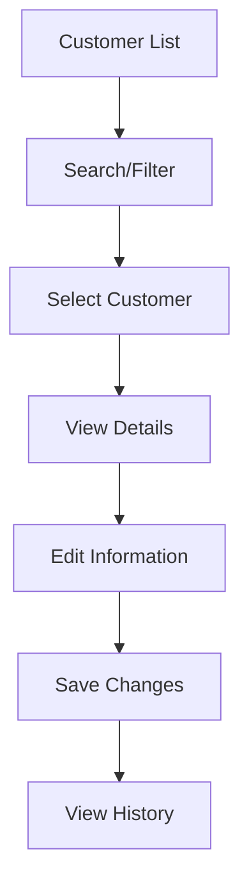

# User Experience

## Overview
This document defines the user experience (UX) guidelines and design principles for the Z5 Distribution System. It focuses on creating intuitive, efficient, and enjoyable user interactions that support business productivity.

## UX Design Principles

### Core Principles
- **User-Centered Design**: Design based on user needs and behaviors
- **Consistency**: Uniform patterns and interactions across the system
- **Efficiency**: Minimize steps and clicks for common tasks
- **Clarity**: Clear information hierarchy and visual communication
- **Feedback**: Immediate and clear feedback for user actions
- **Error Prevention**: Proactive design to prevent user errors

### Business Context
- **Productivity Focus**: Optimize for business efficiency
- **Role-Based Experience**: Tailored experiences for different user roles
- **Data-Driven Decisions**: Support informed decision making
- **Workflow Integration**: Seamless integration with business processes
- **Scalability**: Experience that grows with business needs

## User Personas

### Primary Users

#### Sales Representative (Normal User)
- **Goals**: Create orders, manage customers, track sales
- **Pain Points**: Complex order entry, slow data entry, unclear status
- **Needs**: Quick order creation, customer lookup, order tracking
- **Experience Level**: Intermediate computer users

#### Manager (Admin User)
- **Goals**: Oversee operations, analyze performance, manage team
- **Pain Points**: Lack of visibility, manual reporting, team coordination
- **Needs**: Dashboard insights, team management, performance metrics
- **Experience Level**: Advanced computer users

#### System Administrator (Root User)
- **Goals**: System configuration, user management, data maintenance
- **Pain Points**: Complex configuration, user support, system maintenance
- **Needs**: System control, user management, technical configuration
- **Experience Level**: Expert computer users

## User Journey Mapping

### Order Creation Journey


### Customer Management Journey


## Information Architecture

### Navigation Structure
```
Dashboard
├── Orders
│   ├── All Orders
│   ├── Create Order
│   ├── Pending Orders
│   └── Order Reports
├── Sales
│   ├── All Sales
│   ├── Create Sale
│   ├── Sales Reports
│   └── Performance Metrics
├── Customers
│   ├── Customer List
│   ├── Add Customer
│   ├── Customer Details
│   └── Customer Reports
├── Products
│   ├── Product Catalog
│   ├── Add Product
│   ├── Categories
│   └── Brands
├── Inventory
│   ├── Stock Levels
│   ├── Stock Movements
│   ├── Transfers
│   └── Alerts
├── Payments
│   ├── Payment List
│   ├── Create Payment
│   ├── Outstanding Payments
│   └── Payment Reports
└── Reports
    ├── Sales Reports
    ├── Inventory Reports
    ├── Customer Reports
    └── Financial Reports
```

### Content Hierarchy
- **Primary Actions**: Most important user actions prominently displayed
- **Secondary Actions**: Supporting actions in secondary positions
- **Tertiary Actions**: Less common actions in dropdowns or menus
- **Contextual Actions**: Actions relevant to current content

## Interaction Design

### Form Design Principles
```html
<!-- Progressive disclosure -->
<div class="form-section">
    <h3>Customer Information</h3>
    <div class="form-group">
        <label for="company-name">Company Name *</label>
        <input type="text" id="company-name" required>
        <div class="help-text">Enter the legal company name</div>
    </div>
</div>

<div class="form-section">
    <h3>Contact Details</h3>
    <div class="form-group">
        <label for="email">Email Address</label>
        <input type="email" id="email">
        <div class="help-text">We'll send order confirmations here</div>
    </div>
</div>

<!-- Smart defaults -->
<div class="form-group">
    <label for="order-date">Order Date</label>
    <input type="date" id="order-date" value="{{ today() }}">
</div>

<!-- Contextual help -->
<div class="form-group">
    <label for="payment-method">Payment Method</label>
    <select id="payment-method">
        <option value="">Select payment method</option>
        <option value="cash">Cash</option>
        <option value="bank_transfer">Bank Transfer</option>
    </select>
    <button type="button" class="help-button" aria-label="Payment method help">
        <svg aria-hidden="true"><path d="M8.228 9c.549-1.165 2.03-2 3.772-2 2.21 0 4 1.343 4 3 0 1.4-1.278 2.575-3.006 2.907-.542.104-.994.54-.994 1.093m0 3h.01M21 12a9 9 0 11-18 0 9 9 0 0118 0z"></path></svg>
    </button>
</div>
```

### Data Entry Optimization
```html
<!-- Auto-complete and suggestions -->
<div class="form-group">
    <label for="customer-search">Customer</label>
    <input type="text" 
           id="customer-search" 
           autocomplete="off"
           data-autocomplete="customers">
    <div class="autocomplete-suggestions" hidden>
        <!-- Suggestions will be populated dynamically -->
    </div>
</div>

<!-- Smart product selection -->
<div class="form-group">
    <label for="product-search">Product</label>
    <input type="text" 
           id="product-search" 
           placeholder="Search by name, SKU, or category"
           data-autocomplete="products">
    <div class="product-suggestions" hidden>
        <!-- Product suggestions with images and details -->
    </div>
</div>

<!-- Quantity with smart defaults -->
<div class="form-group">
    <label for="quantity">Quantity</label>
    <input type="number" 
           id="quantity" 
           min="1" 
           value="1"
           data-product-id="123">
    <div class="quantity-help">
        <span class="available-stock">Available: 50 units</span>
        <span class="reorder-info">Reorder point: 20 units</span>
    </div>
</div>
```

### Feedback and Validation
```html
<!-- Real-time validation -->
<div class="form-group">
    <label for="email">Email Address</label>
    <input type="email" 
           id="email" 
           data-validate="email"
           data-validate-message="Please enter a valid email address">
    <div class="validation-message" hidden>
        <!-- Validation messages -->
    </div>
</div>

<!-- Success feedback -->
<div class="success-message" role="alert">
    <svg aria-hidden="true"><path d="M9 12l2 2 4-4m6 2a9 9 0 11-18 0 9 9 0 0118 0z"></path></svg>
    Order created successfully!
</div>

<!-- Error feedback -->
<div class="error-message" role="alert">
    <svg aria-hidden="true"><path d="M12 8v4m0 4h.01M21 12a9 9 0 11-18 0 9 9 0 0118 0z"></path></svg>
    Please correct the errors below and try again.
</div>
```

## Visual Design

### Typography Hierarchy
```css
/* Clear typography hierarchy */
.heading-1 {
    font-size: 2.25rem;
    font-weight: 700;
    line-height: 1.2;
    color: #111827;
}

.heading-2 {
    font-size: 1.875rem;
    font-weight: 600;
    line-height: 1.3;
    color: #111827;
}

.heading-3 {
    font-size: 1.5rem;
    font-weight: 600;
    line-height: 1.4;
    color: #111827;
}

.body-large {
    font-size: 1.125rem;
    line-height: 1.6;
    color: #374151;
}

.body-regular {
    font-size: 1rem;
    line-height: 1.6;
    color: #374151;
}

.body-small {
    font-size: 0.875rem;
    line-height: 1.5;
    color: #6b7280;
}
```

### Color System
```css
/* Semantic color system */
:root {
    /* Primary colors */
    --color-primary: #2563eb;
    --color-primary-light: #3b82f6;
    --color-primary-dark: #1d4ed8;
    
    /* Secondary colors */
    --color-secondary: #6b7280;
    --color-secondary-light: #9ca3af;
    --color-secondary-dark: #4b5563;
    
    /* Status colors */
    --color-success: #059669;
    --color-warning: #d97706;
    --color-error: #dc2626;
    --color-info: #0891b2;
    
    /* Neutral colors */
    --color-white: #ffffff;
    --color-gray-50: #f9fafb;
    --color-gray-100: #f3f4f6;
    --color-gray-200: #e5e7eb;
    --color-gray-300: #d1d5db;
    --color-gray-400: #9ca3af;
    --color-gray-500: #6b7280;
    --color-gray-600: #4b5563;
    --color-gray-700: #374151;
    --color-gray-800: #1f2937;
    --color-gray-900: #111827;
}
```

### Spacing System
```css
/* Consistent spacing scale */
:root {
    --space-1: 0.25rem;   /* 4px */
    --space-2: 0.5rem;     /* 8px */
    --space-3: 0.75rem;    /* 12px */
    --space-4: 1rem;       /* 16px */
    --space-5: 1.25rem;    /* 20px */
    --space-6: 1.5rem;     /* 24px */
    --space-8: 2rem;       /* 32px */
    --space-10: 2.5rem;    /* 40px */
    --space-12: 3rem;      /* 48px */
    --space-16: 4rem;      /* 64px */
    --space-20: 5rem;      /* 80px */
    --space-24: 6rem;      /* 96px */
}
```

## Component Design

### Button Design
```html
<!-- Primary button -->
<button class="btn btn-primary">
    Create Order
</button>

<!-- Secondary button -->
<button class="btn btn-secondary">
    Cancel
</button>

<!-- Danger button -->
<button class="btn btn-danger">
    Delete Order
</button>

<!-- Loading state -->
<button class="btn btn-primary" disabled>
    <svg class="animate-spin" aria-hidden="true">
        <path d="M4 12a8 8 0 018-8V0C5.373 0 0 5.373 0 12h4zm2 5.291A7.962 7.962 0 014 12H0c0 3.042 1.135 5.824 3 7.938l3-2.647z"></path>
    </svg>
    Processing...
</button>
```

### Card Design
```html
<div class="card">
    <div class="card-header">
        <h3 class="card-title">Order Details</h3>
        <div class="card-actions">
            <button class="btn btn-sm btn-secondary">Edit</button>
            <button class="btn btn-sm btn-danger">Delete</button>
        </div>
    </div>
    <div class="card-body">
        <dl class="data-list">
            <dt>Order Number</dt>
            <dd>ORD2024010001</dd>
            <dt>Customer</dt>
            <dd>ABC Company Ltd</dd>
            <dt>Total Amount</dt>
            <dd>Rs 1,250.00</dd>
        </dl>
    </div>
    <div class="card-footer">
        <div class="status-badge status-confirmed">
            Confirmed
        </div>
    </div>
</div>
```

### Table Design
```html
<div class="table-container">
    <table class="data-table">
        <thead>
            <tr>
                <th>
                    <input type="checkbox" aria-label="Select all orders">
                </th>
                <th>
                    <button class="sort-button" data-sort="order_number">
                        Order Number
                        <svg aria-hidden="true"><path d="M5 15l7-7 7 7"></path></svg>
                    </button>
                </th>
                <th>
                    <button class="sort-button" data-sort="customer">
                        Customer
                        <svg aria-hidden="true"><path d="M5 15l7-7 7 7"></path></svg>
                    </button>
                </th>
                <th>
                    <button class="sort-button" data-sort="total">
                        Total
                        <svg aria-hidden="true"><path d="M5 15l7-7 7 7"></path></svg>
                    </button>
                </th>
                <th>
                    <button class="sort-button" data-sort="status">
                        Status
                        <svg aria-hidden="true"><path d="M5 15l7-7 7 7"></path></svg>
                    </button>
                </th>
                <th>Actions</th>
            </tr>
        </thead>
        <tbody>
            <tr>
                <td>
                    <input type="checkbox" aria-label="Select order ORD2024010001">
                </td>
                <td>
                    <a href="/orders/ORD2024010001" class="link-primary">
                        ORD2024010001
                    </a>
                </td>
                <td>ABC Company Ltd</td>
                <td>Rs 1,250.00</td>
                <td>
                    <span class="status-badge status-confirmed">
                        Confirmed
                    </span>
                </td>
                <td>
                    <div class="action-menu">
                        <button class="action-trigger" aria-label="More actions">
                            <svg aria-hidden="true"><path d="M12 5v.01M12 12v.01M12 19v.01M12 6a1 1 0 110-2 1 1 0 010 2zm0 7a1 1 0 110-2 1 1 0 010 2zm0 7a1 1 0 110-2 1 1 0 010 2z"></path></svg>
                        </button>
                        <div class="action-menu-content" hidden>
                            <a href="/orders/ORD2024010001/edit">Edit</a>
                            <a href="/orders/ORD2024010001/pdf">Download PDF</a>
                            <button onclick="deleteOrder('ORD2024010001')">Delete</button>
                        </div>
                    </div>
                </td>
            </tr>
        </tbody>
    </table>
</div>
```

## Performance and Usability

### Loading States
```html
<!-- Skeleton loading -->
<div class="skeleton-card">
    <div class="skeleton-header">
        <div class="skeleton-line skeleton-title"></div>
        <div class="skeleton-line skeleton-subtitle"></div>
    </div>
    <div class="skeleton-body">
        <div class="skeleton-line"></div>
        <div class="skeleton-line"></div>
        <div class="skeleton-line skeleton-short"></div>
    </div>
</div>

<!-- Progress indicators -->
<div class="progress-bar">
    <div class="progress-fill" style="width: 60%"></div>
</div>

<!-- Loading spinners -->
<div class="loading-spinner" aria-label="Loading">
    <svg class="animate-spin">
        <path d="M4 12a8 8 0 018-8V0C5.373 0 0 5.373 0 12h4zm2 5.291A7.962 7.962 0 014 12H0c0 3.042 1.135 5.824 3 7.938l3-2.647z"></path>
    </svg>
</div>
```

### Error Handling
```html
<!-- Inline errors -->
<div class="form-group">
    <label for="email">Email Address</label>
    <input type="email" id="email" class="error" aria-invalid="true">
    <div class="error-message" role="alert">
        Please enter a valid email address
    </div>
</div>

<!-- Page-level errors -->
<div class="error-page">
    <div class="error-icon">
        <svg aria-hidden="true"><path d="M12 8v4m0 4h.01M21 12a9 9 0 11-18 0 9 9 0 0118 0z"></path></svg>
    </div>
    <h2>Something went wrong</h2>
    <p>We're sorry, but something unexpected happened. Please try again.</p>
    <button class="btn btn-primary" onclick="retry()">
        Try Again
    </button>
</div>

<!-- Empty states -->
<div class="empty-state">
    <div class="empty-icon">
        <svg aria-hidden="true"><path d="M20 7l-8-4-8 4m16 0l-8 4m8-4v10l-8 4m0-10L4 7m8 4v10M4 7v10l8 4"></path></svg>
    </div>
    <h3>No orders found</h3>
    <p>You haven't created any orders yet. Get started by creating your first order.</p>
    <button class="btn btn-primary" onclick="createOrder()">
        Create Order
    </button>
</div>
```

## Responsive Design

### Mobile-First Approach
```css
/* Mobile styles (default) */
.container {
    padding: 1rem;
}

.navigation {
    display: none;
}

.mobile-menu {
    display: block;
}

/* Tablet styles */
@media (min-width: 768px) {
    .container {
        padding: 2rem;
    }
    
    .mobile-menu {
        display: none;
    }
    
    .navigation {
        display: block;
    }
}

/* Desktop styles */
@media (min-width: 1024px) {
    .container {
        max-width: 1200px;
        margin: 0 auto;
    }
    
    .sidebar {
        width: 250px;
    }
    
    .main-content {
        margin-left: 250px;
    }
}
```

### Touch-Friendly Design
```css
/* Touch targets */
.button {
    min-height: 44px;
    min-width: 44px;
    padding: 0.75rem 1.5rem;
}

/* Touch gestures */
.swipeable {
    touch-action: pan-x;
}

.pull-to-refresh {
    touch-action: pan-y;
}

/* Hover states for touch devices */
@media (hover: hover) {
    .button:hover {
        background-color: var(--color-primary-dark);
    }
}

@media (hover: none) {
    .button:active {
        background-color: var(--color-primary-dark);
    }
}
```

## Testing and Validation

### Usability Testing
- **Task Completion**: Measure success rates for common tasks
- **Time to Complete**: Track how long tasks take
- **Error Rates**: Count user errors and recovery
- **User Satisfaction**: Collect feedback on experience
- **Accessibility**: Test with assistive technologies

### A/B Testing
- **Button Placement**: Test different button positions
- **Form Layout**: Compare form designs
- **Navigation Structure**: Test different navigation patterns
- **Color Schemes**: Test different color combinations
- **Content Organization**: Test different information layouts

### User Feedback
```html
<!-- Feedback collection -->
<div class="feedback-widget">
    <button class="feedback-trigger" onclick="showFeedback()">
        <svg aria-hidden="true"><path d="M8 12h.01M12 12h.01M16 12h.01M21 12c0 4.418-4.03 8-9 8a9.863 9.863 0 01-4.255-.949L3 20l1.395-3.72C3.512 15.042 3 13.574 3 12c0-4.418 4.03-8 9-8s9 3.582 9 8z"></path></svg>
        Feedback
    </button>
</div>

<!-- User satisfaction survey -->
<div class="satisfaction-survey" hidden>
    <h3>How satisfied are you with this feature?</h3>
    <div class="rating-scale">
        <button class="rating-button" data-rating="1">1</button>
        <button class="rating-button" data-rating="2">2</button>
        <button class="rating-button" data-rating="3">3</button>
        <button class="rating-button" data-rating="4">4</button>
        <button class="rating-button" data-rating="5">5</button>
    </div>
    <textarea placeholder="Tell us more about your experience..."></textarea>
    <button class="btn btn-primary" onclick="submitFeedback()">
        Submit Feedback
    </button>
</div>
```

This comprehensive user experience design ensures the Z5 Distribution System provides an intuitive, efficient, and enjoyable experience for all users while supporting business productivity and growth.
